# PARCIALAREPT2-MANUELS
## Enunciado
Diseñé, construya y despliegue un aplicación web para investigar la conjetura de Collatz. El programa debe estar desplegado en AWS. LAs tecnologías usadas en la solución deben ser maven, git, github, maven, sparkjava, html5, y js. No use liberías adicionales.

## Problema:
Diseñe un prototipo de sistema de microservicios que tenga un servicio (En la figura se representa con el nombre Math Services) para computar las funciones numéricas.  El servicio de las funciones numéricas debe estar desplegado en al menos dos instancias virtuales de EC2. Adicionalmente, debe implementar un service proxy que reciba las solicitudes de llamado desde los clientes  y se las delega a las dos instancias del servicio numérico usando un algoritmo de round-robin. El proxy deberá estar desplegado en otra máquina EC2. Asegúrese que se pueden configurar las direcciones y puertos de las instancias del servicio en el proxy usando variables de entorno del sistema operativo.  Finalmente, construya un cliente Web mínimo con un formulario que reciba el valor y de manera asíncrona invoke el servicio en el PROXY. Puede hacer un formulario para cada una de las funciones. El cliente debe ser escrito en HTML y JS.

## Sobre las funciones numéricas:
La conjetura de Collatz dice que si usted crea una secuencia de números, a partir de cualquier entero positivo, siguiendo las reglas descritas abajo, siempre la secuencia terminará en le número 1. Esta conjetura aún no se ha demostrado.

Las reglas son:

 * f(n)=n/2 ----> si n es par.
 * f(n)=3n+1 ----> si n es impar.
 
La secuencia se construye a partir de un número dado k así:

* a0=k
* ai=f(ai−1)

Por ejemplo, dato el número k=13

* la secuencia sería: 13→40→20→10→5→16→8→4→2→1

## Instalacion
```bash
git init
```
```bash
git Clone https://github.com/ManuelSuarez07/PARCIALAREPT2-MANUELS.git
```
```bash
cd PARCIALAREPT2-MANUELS-main
```
### En un terminal para cada cosa (Uno para Proxy, otro para Collatz)

* Proxy:
```bash
cd proxy
```
```bash
mvn clean install
```
```bash
mvn spring-boot:run
```
* Collatz:
```bash
cd collatz
```
```bash
mvn clean install
```
```bash
mvn spring-boot:run
```

## Pruebas de manera local:
* Para el formulario (Proxy) ingresar a:

```bash
http://localhost:8080/
```


* Para ingresar directamente al calculo y obtener la respuesta en formato JSON:

```bash
http://localhost:8081/collatz?n=13
```
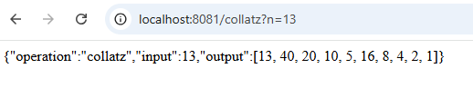

## Implementacion en AWS

### Imagenes del paso a paso para implementarlo en AWS

1.  

2.  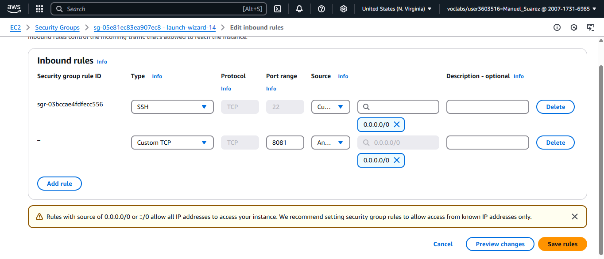

3.  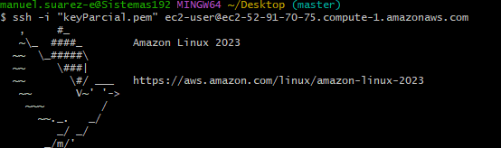

4.  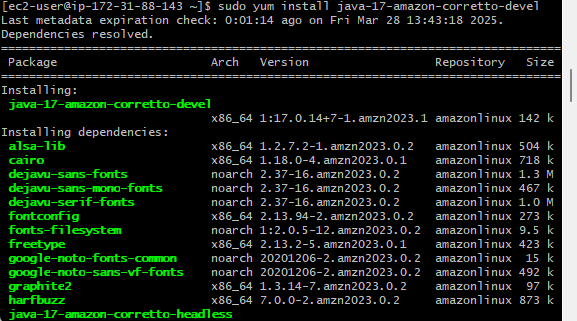

5.  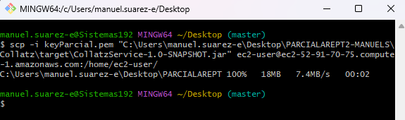

6.  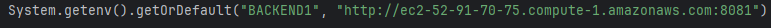

7.  

8.  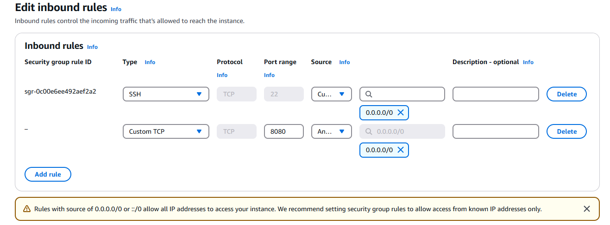

9.  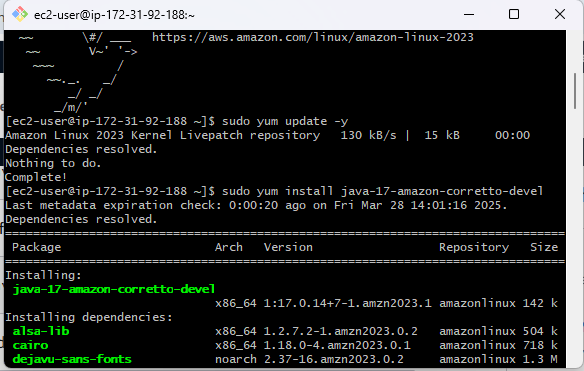

10. 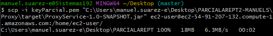

11. 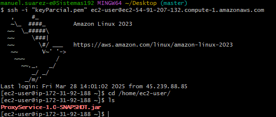

12. 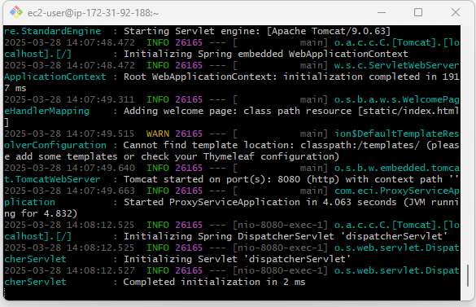

13. 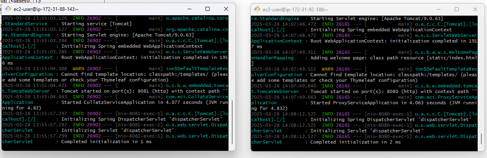

14. 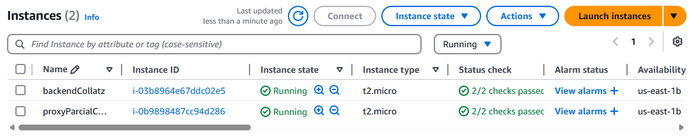

15. 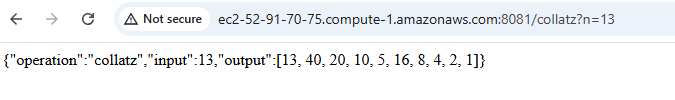

16. 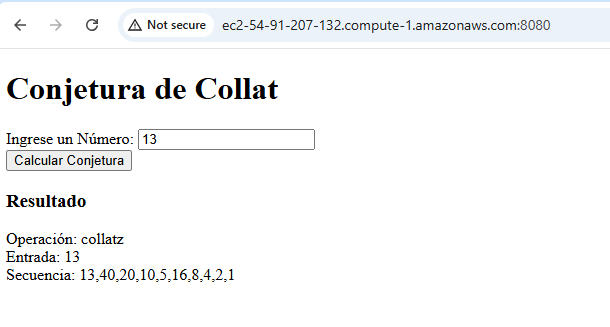

### Video de Despliegue en AWS

[](https://youtu.be/u7r9eu_UxGI)

## AUTOR
[Manuel Suarez](https://github.com/ManuelSuarez07) 
